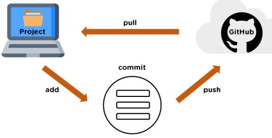

# _Git 使用方法_
## 示意图

> git是一种分布式版本控制器。

## 初始化配置
#### （1） 查看所有的配置以及它们所在的文件
> $ git config --list --show-origin
####（2）配置用户信息
> 添加用户名
>
> $ git config --global user.name "用户名"
####（3）配置用户邮箱
> 添加用户邮箱
>
> $ git config --global user.email "用户邮箱"
####（4）查看配置信息
> 查看用户名
>
> $ git config user.name
>
> 查看用户邮箱
>
> $ git config user.email
>
> 检查当前能找到的配置信息
>
> $ git config --list

## 获取Git仓库
> 获取现有仓库
>
> $ git clone "url地址/ssh" "指定名"

## 检查当前文件状态
> $ git status

## 查看提交历史
> $ git log

## 撤消操作
> $ git reset "指定的暂存文件"

## 远程仓库的使用
#### （1）添加远程仓库
> 添加一个远程库，可指定简称，url地址
>
> git remote add "指定简称" "url地址"
#### （2）查看远程仓库
> 查看已配置的远程仓库
>
> git remote
>
> 查看远程仓库简写以及对应的url
>
> git remote -v
#### （3）远程仓库的抓取与拉取
> git fetch "简称"
>
> 可以用 git pull 命令来自动抓取后合并该远程分支到当前分支。
#### （4）其他
> 查看某个远程仓库
>
> $ git remote show "简称"
>
> 远程仓库的重命名与移除
>
> $ git remote rename "当前简称" "指定简称"
>
> $ git remote remove "简称"

## 从创建到提交流程
#### （1）初始化仓库
> $ git init
#### （2）添加文件至缓存区
> 指定文件
>
> $ git add "指定文件名"
>
> 所有文件
>
> $ git add .
#### （3）提交文件
> $ git commit -m "添加描述信息"
#### （4）提交到Github
> $ git remote add "简称" "url地址/ssh"
>
> $ git push -u origin master
